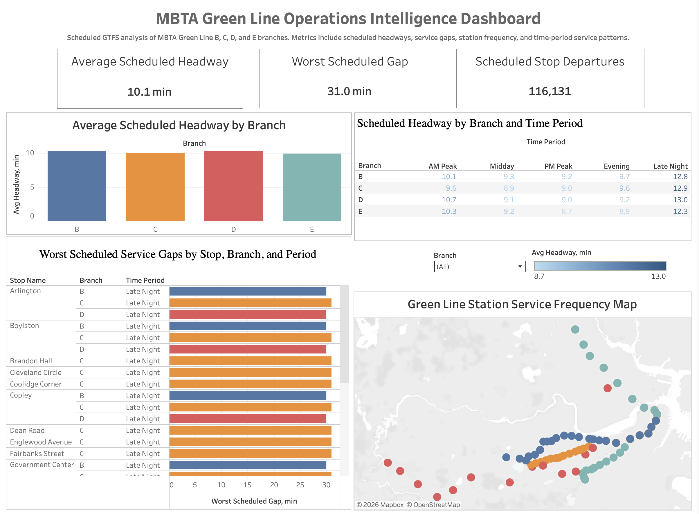

# Green Line Operations Intelligence

A production-style transit operations analytics portfolio project using MBTA GTFS schedule data to analyze Green Line service patterns, scheduled headways, service gaps, station coverage, and route-level operational KPIs.

This project demonstrates an end-to-end analytics workflow using Python, SQL, SQLite, Tableau, Git, and GitHub.

---

## Project Overview

The goal of this project is to build a practical transit operations intelligence system using publicly available MBTA GTFS data.

The workflow transforms raw GTFS schedule files into a structured SQLite database, creates reusable analytical SQL views, calculates scheduled headway metrics, exports Tableau-ready CSV files, and presents the results in a Tableau dashboard.

This project is designed as a portfolio case study for:

- Data Analyst roles
- Business Intelligence Analyst roles
- Data Engineer roles
- Transit Operations Analyst roles

---

## Project Status

Status: **Complete - Portfolio Version 1**

Completed components:

- MBTA GTFS downloader
- GTFS-to-SQLite ETL loader
- SQL database validation checks
- Green Line-only analytical views
- Scheduled headway analysis
- Tableau-ready CSV export script
- Tableau operations dashboard
- Final analysis report
- Project documentation

---

## Dashboard Preview



**Interactive Tableau Dashboard:** https://public.tableau.com/app/profile/lakshay.munjal6511/viz/MBTAGreenLineOperationsIntelligenceDashboard/GreenLineOperationsDashboard?publish=yes

---

## Dashboard KPIs

| KPI | Value |
|---|---:|
| Average Scheduled Headway | 10.1 min |
| Worst Scheduled Gap | 31.0 min |
| Scheduled Stop Departures | 116,131 |

---

## Project Pipeline

```text
MBTA GTFS ZIP
→ Extracted GTFS text files
→ SQLite database
→ SQL validation queries
→ Green Line analytical views
→ Scheduled headway calculations
→ Tableau-ready CSV exports
→ Tableau operations dashboard
→ Final analysis report
```

---

## Repository Structure

```text
green-line-operations-intelligence/
├── README.md
├── LICENSE
├── .gitignore
├── requirements.txt
├── data/
│   ├── raw/
│   ├── processed/
│   └── external/
├── notebooks/
├── sql/
│   ├── 01_database_validation.sql
│   ├── 02_green_line_views.sql
│   └── 03_headway_analysis.sql
├── src/
│   ├── download_gtfs.py
│   ├── load_gtfs_to_sqlite.py
│   ├── export_tableau_data.py
│   └── run_pipeline.py
├── dashboard/
│   └── green_line_operations_dashboard.twbx
├── reports/
│   └── green_line_operations_analysis.md
└── images/
    └── green_line_operations_dashboard.png
```

---

## Data Source

This project uses the official MBTA static GTFS feed.

Core GTFS files used include:

- `agency.txt`
- `routes.txt`
- `trips.txt`
- `stops.txt`
- `stop_times.txt`
- `calendar.txt`
- `calendar_dates.txt`

Raw GTFS files and generated SQLite databases are not committed to GitHub because they are reproducible and may be large.

---

## Analytical Scope

This project focuses on scheduled MBTA Green Line rail branches:

- Green Line B
- Green Line C
- Green Line D
- Green Line E

Temporary shuttle routes, Greenbush commuter rail service, and other non-Green-Line services are excluded from the core analytical views.

---

## Key Metrics

The project calculates:

- Scheduled stop departures
- Average scheduled headway
- Minimum scheduled headway
- Worst scheduled service gap
- Headway standard deviation
- Headway variance
- Service frequency by branch
- Service frequency by station
- Service frequency by direction
- Service frequency by time period
- Worst scheduled gaps by stop, branch, and time period

---

## Time Period Definitions

Scheduled departures are grouped into the following operating periods:

| Time Period | Hours |
|---|---|
| AM Peak | 6:00 AM - 8:59 AM |
| Midday | 9:00 AM - 3:59 PM |
| PM Peak | 4:00 PM - 6:59 PM |
| Evening | 7:00 PM - 11:59 PM |
| Late Night | All other times |

---

## Tableau Dashboard

The Tableau dashboard includes:

### Executive KPI Cards

- Average Scheduled Headway
- Worst Scheduled Gap
- Scheduled Stop Departures

### Route Performance

- Average Scheduled Headway by Green Line Branch
- Branch-level comparison across Green Line B, C, D, and E

### Time Period Analysis

- Scheduled Headway by Branch and Time Period
- AM Peak, Midday, PM Peak, Evening, and Late Night comparison

### Station Performance

- Worst Scheduled Service Gaps by Stop, Branch, and Period
- Station-level service frequency review

### Map View

- Green Line Station Service Frequency Map
- Geographic station distribution by branch

The interactive Tableau Public dashboard is available here:

```text
https://public.tableau.com/app/profile/lakshay.munjal6511/viz/MBTAGreenLineOperationsIntelligenceDashboard/GreenLineOperationsDashboard?publish=yes
```

The packaged Tableau workbook is stored in:

```text
dashboard/green_line_operations_dashboard.twbx
```

---

## Key Findings

### 1. Overall Scheduled Frequency

The average scheduled Green Line headway is approximately **10.1 minutes**, indicating frequent scheduled service across the analyzed Green Line branches.

### 2. Worst Scheduled Gap

The largest observed scheduled service gap is approximately **31.0 minutes**. The largest gaps are primarily associated with lower-frequency service periods such as late night.

### 3. Branch-Level Service

The B, C, D, and E branches show broadly similar scheduled headways at the aggregate level, suggesting relatively balanced scheduled service frequency across the Green Line branches.

### 4. Time-of-Day Patterns

The dashboard shows that AM Peak and PM Peak periods generally have stronger scheduled frequency, while late-night service has longer headways.

### 5. Station-Level Patterns

The station service map and worst-gaps chart help identify where scheduled service is most frequent and where the largest scheduled gaps occur.

---

## How to Run the Project

### 1. Clone the repository

```bash
git clone https://github.com/LakshayMunjal-dev/green-line-operations-intelligence
cd green-line-operations-intelligence
```

### 2. Create and activate a virtual environment

```bash
python3 -m venv .venv
source .venv/bin/activate
```

### 3. Install dependencies

```bash
pip install -r requirements.txt
```

### 4. Run the full backend pipeline

```bash
python src/run_pipeline.py
```

This command runs:

```text
download_gtfs.py
→ load_gtfs_to_sqlite.py
→ 02_green_line_views.sql
→ 03_headway_analysis.sql
→ export_tableau_data.py
```

### 5. Open the Tableau workbook

Open:

```text
dashboard/green_line_operations_dashboard.twbx
```

If needed, reconnect the Tableau workbook to the CSV files under:

```text
data/processed/tableau_exports/
```

---

## Manual Pipeline Steps

The full pipeline can also be run step by step.

### Download GTFS data

```bash
python src/download_gtfs.py
```

### Load GTFS into SQLite

```bash
python src/load_gtfs_to_sqlite.py
```

### Apply SQL views and analysis

```bash
sqlite3 data/processed/green_line_ops.db < sql/02_green_line_views.sql
sqlite3 data/processed/green_line_ops.db < sql/03_headway_analysis.sql
```

### Optional database validation

```bash
sqlite3 -header -column data/processed/green_line_ops.db < sql/01_database_validation.sql
```

### Export Tableau-ready CSV files

```bash
python src/export_tableau_data.py
```

---

## Tableau Export Files

The export script creates the following files:

| File | Purpose |
|---|---|
| `green_line_routes.csv` | Green Line branch reference table |
| `green_line_stops.csv` | Stop and station location data |
| `green_line_trips.csv` | Green Line trip-level data |
| `headway_detail.csv` | Detailed departure-level headway records |
| `headway_summary.csv` | Stop, route, direction, and time-period headway KPIs |
| `route_time_period_summary.csv` | Route-level summary by time period |
| `worst_scheduled_gaps.csv` | Highest scheduled service gaps |
| `station_service_frequency.csv` | Station-level service frequency metrics |

---

## Technical Skills Demonstrated

This project demonstrates:

- Python ETL scripting
- Public transit GTFS data processing
- SQLite database creation
- SQL validation checks
- SQL analytical views
- SQL window functions
- Scheduled headway calculation
- Tableau-ready data modeling
- Dashboard design
- Transit operations analytics
- Git/GitHub project organization
- Portfolio documentation

---

## Limitations

This analysis uses **static scheduled GTFS data**, not real-time vehicle location or actual arrival/departure data.

The dashboard measures scheduled service patterns, not actual operational performance.

The current project does not measure:

- Actual delays
- Vehicle bunching
- Canceled trips
- Passenger loads
- Real-time reliability
- On-time performance
- Service disruptions

---

## Future Improvements

Potential next steps include:

1. Add MBTA real-time data for actual service performance.
2. Compare scheduled vs actual arrivals.
3. Calculate schedule adherence.
4. Add reliability scoring by branch and station.
5. Add peak vs off-peak performance KPIs.
6. Expand the dashboard to other MBTA lines.
7. Publish the Tableau dashboard publicly.
8. Add automated data refresh support.

---

## Final Report

The final written analysis is available here:

```text
reports/green_line_operations_analysis.md
```

---

## Conclusion

The Green Line Operations Intelligence project successfully builds an end-to-end transit analytics workflow from raw MBTA GTFS schedule data to a Tableau operations dashboard.
